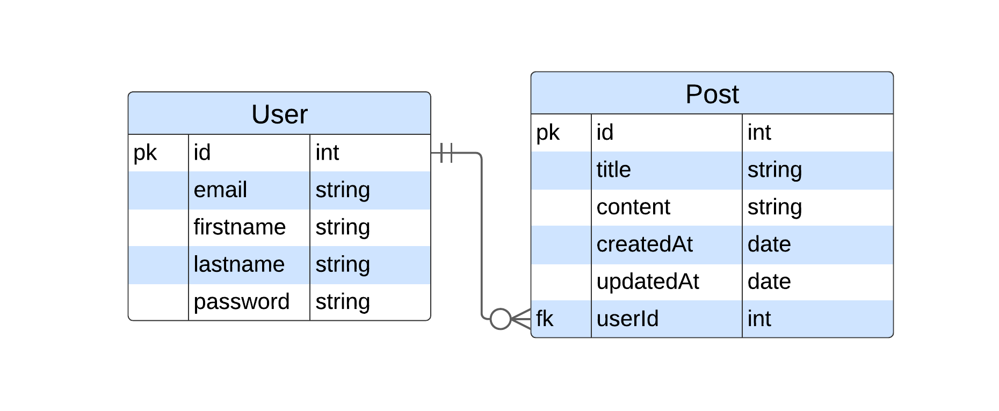

# Descripción

Rest API para gestionar posts de usuarios.

Techs:

- Nest.js
- TypeORM
- JWT para auth

## Entity Relationship Diagram



## API Endpoints:

<table>
  <tr>
    <th>HTTP<br> Method</th>
    <th>Endpoint</th>
    <th>Description</th>
    <th>Payload</th>
    <th>Response</th>
  </tr>
  <tr>
    <td></td>
    <td colspan="4"><strong>posts</strong></td>
  </tr>
  <tr>
    <td>POST</td>
    <td>/posts</td>
    <td>Create<br> a new post</td>
    <td>
        { 
            title: string,<br> 
            content: string 
        }<br><br>
    Headers: {<br> 
    &nbsp;Authorization: Bearer token <br>
    }
    </td>
    <td>
      {
        id: number,<br>
        title: string,<br>
        content: string,<br>
        createdAt: string,<br>
        updatedAt: string,<br>
        user: { id: number, name: string } }
    </td>
  </tr>
  <tr>
    <td>GET</td>
    <td>/posts</td>
    <td>Get all posts</td>
    <td> --- </td>
    <td>Array of post objects</td>
  </tr>
  <tr>
    <td>GET</td>
    <td>/posts/:id</td>
    <td>Get a post<br> by ID</td>
    <td>---</td>
    <td>
      {
        id: number,<br>
        title: string,<br>
        content: string,<br>
        createdAt: string,<br>
        updatedAt: string,<br>
        user: { id: number, name: string } }
    </td>
  </tr>
  <tr>
    <td>PATCH</td>
    <td>/posts/:id</td>
    <td>Update a<br> post by ID</td>
    <td>
    { 
        title: string,<br> 
        content: string
    }<br><br>
    Headers: {<br> 
    &nbsp;Authorization: Bearer token <br>
    }
    </td>
    <td>
      {
        id: number,<br>
        title: string,<br>
        content: string,<br>
        createdAt: string,<br>
        updatedAt: string,<br>
        user: { id: number, name: string } }
    </td>
  </tr>
  <tr>
    <td>DELETE</td>
    <td>/posts/:id</td>
    <td>Delete a<br> post by ID</td>
    <td>
    Headers: {<br> 
    &nbsp;Authorization: Bearer token <br>
    }
    </td>
    <td>
      {
        id: number,<br>
        title: string,<br>
        content: string,<br>
        createdAt: string,<br>
        updatedAt: string,<br>
        user: { id: number, name: string } }
    </td>
  </tr>
  <tr>
    <td colspan="1"></td>
    <td colspan="4"><strong>users</strong></td>
  </tr>
  <tr>
    <td>POST</td>
    <td>/users/signup</td>
    <td>Create a<br> new user</td>
    <td>
      {
        email: string,<br>
        firstname: string,<br>
        lastname: string,<br>
        password: string
      }
    </td>
    <td>
      {
        token: string
      }
    </td>
  </tr>
  <tr>
    <td>POST</td>
    <td>/users/signin</td>
    <td>Sign in an <br> existing user</td>
    <td>
      {
        email: string,<br>
        password: string
      }
    </td>
    <td>
      {
        token: string
      }
    </td>
  </tr>
  <tr>
    <td>GET</td>
    <td>/users</td>
    <td>Get all users</td>
    <td>---</td>
    <td>Array of user objects</td>
  </tr>
  <tr>
    <td>GET</td>
    <td>/users/:id</td>
    <td>Get a<br> user by ID</td>
    <td>---</td>
    <td>
      {
        id: number,<br>
        email: string,<br>
        createdAt: string,<br>
        updatedAt: string
      }
    </td>
  </tr>
  <tr>
    <td>GET</td>
    <td>/users/me</td>
    <td>Get info<br> of logged user</td>
    <td>
    Headers: {<br> 
    &nbsp;Authorization: Bearer token <br>
    }
    </td>
    <td>
      {
        id: number,<br>
        email: string,<br>
        iat: number
      }
    </td>
  </tr>
</table>

## Correr localmente

### Clonar el repo e instalar dependencias

```bash
git clone xxx-github-repo-xxx
npm install
```

### Configuración archivo .env

Para configurar las variables de entorno, crea un archivo `.env` en el directorio raíz con el siguiente contenido:

```plaintext
JWT_SECRET=authentication_secret_key_is_used_in_the_process_of_signing_a_token
```

### Correr la app en modo desarrollo

```bash
npm run start:dev
```

## Tests

### Unit tests

```bash
npm run test
```

### e2e Tests

```bash
npm run test:e2e
```
